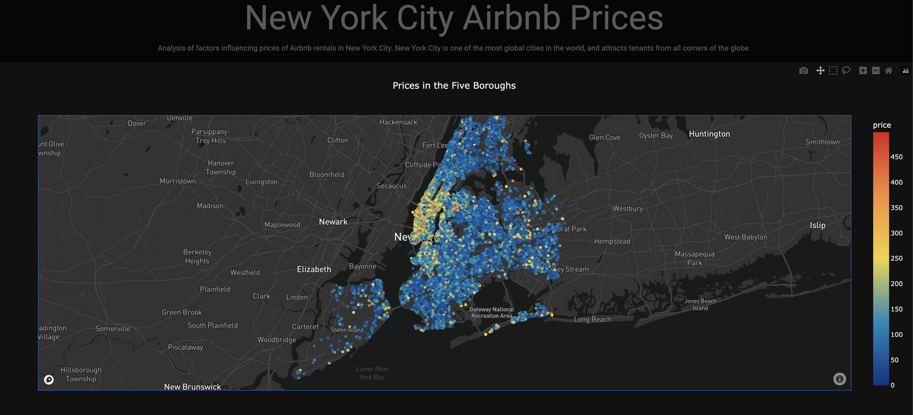

# Python NYC Airbnb

Data visualization of historical Airbnb rental prices in New York City.

Applet is made using primarily Python and the Dash library, with some elements of CSS and Bootstrap. The Mapbox API is used to overlay Airbnb points over a map of New York. Website is deployed using Heroku.

## Plots and Information Displayed

1. **Map Plot** - The first plot uses the Mapbox API along with the longitude and latitude of the various Airbnb rentals to overlay points of various price across New York City. This allows the viewer to obtain an impression of the general pricing of rentals across the five boroughs.

2. **Map Plot** - The second plot performs something similar, but instead of using price as the identifying color the plot uses yearly availability.

3. **Scatter Plot** - The third plot gives a general idea of the types of rentals available. Airbnb listings typically fall into three main types based on the kind of accomodation they offer:

    - Entire home/apt: This type of rental offers guests the entire property, which usually includes a bedroom, living area, kitchen, and bathroom.

    - Private room: In a private room rental, guests have a private bedroom for themselves but may share other spaces like the kitchen, living room, and bathroom with the host or other guests.

    - Shared room: A shared room involves staying in a space that is shared with other people, which could be the host or other guests. This might include shared bedrooms, bathrooms, and common areas.

4. **Box Plot** - We have a plot for viewing the general pricing across boroughs for different types of rentals.

5. **Histogram** - We have a plot for the general pricing of the boroughs overall, regardless of the type of rental.

6. **Bar Plot** - We can compare the average yearly availability across the boroughs, which can provide some insight into how competitive the rental market is in the different areas.

Link to visualization: **https://nycairbnbapp.herokuapp.com/**
